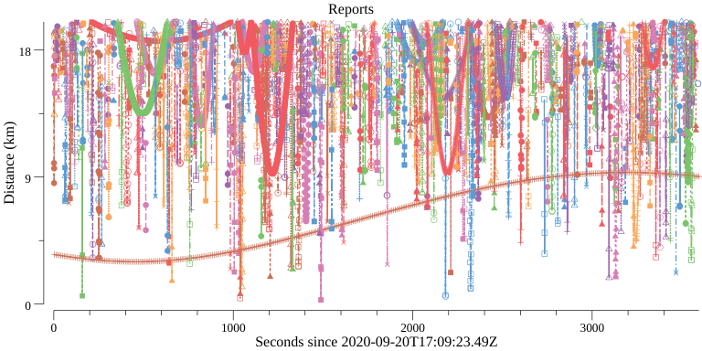

# Streaming Proximity Index (SPI)


## Introduction

This repo contains a [Go](https://golang.org/) implementation of a
streaming index for object proximity in space above Earth.  Currently
this implementation consumes streams of
[TLEs](https://en.wikipedia.org/wiki/Two-line_element_set), and it and
produces a stream of proximity reports.

The emitted reports are _not_ [Conjunction Summary
Messages](https://www.space-track.org/documents/CSM_Guide.pdf) or
related data products. **Output is not intended for any operational,
planning, or decision-making purpose.**  Please see the [license
(MIT)](LICENSE) for this software.

This code is designed to support large catalogs and to participate in
multi-stage event processing systems.  For example, an SPI processor
could consume orbital data produced by multiple upstream processes,
and it could then feed proximity reports to downstream process such as
high-fidelity conjunction analysis, user interfaces, and message
routers.

SPI is the core index for the
[ASTRIA](https://sites.utexas.edu/moriba/astriagraph/)'s Conjunction
Streaming Service (CSS), which includes a message bus, graphical user
interfaces, and other components.  SPI is itself an
[ASTRIA](https://sites.utexas.edu/moriba/astriagraph/) project.


## Usage

### Prerequisites

You need to [install Go](https://golang.org/doc/install) to use this
code.  Once Go is installed, you should be able to download and
compile the tools with

```Shell
go get github.com/ut-astria/spi/...
```


### Batch

For a simple, non-streaming demo, you can pipe TLEs to the demo
program `spibatch`.

Here's an example that uses [Celestrak
data](https://www.celestrak.com/NORAD/elements/).
[`jq`](https://stedolan.github.io/jq/) is used to extract some data
from generated reports.

```Shell
mkdir -p data

for F in starlink planet cosmos-2251-debris.txt 1999-025; do
  curl https://www.celestrak.com/NORAD/elements/$F.txt > data/$F.tle
done

cat data/*.tle |
  spibatch -horizon 3600 |
  tee reports.json |
  jq -r 'select(.Speed > 10 and .Dist < 5)|[.At,.Dist,.Objs[0].LLA.Alt,.Speed,.Objs[0].Name,.Objs[1].Name]|@csv'
```

Here's an example report:

```JSON
{
    "Id": "b569e8cac4e46d81ef0b0abc14fc077dabd3423a",
    "Sig": "506c368347d0e191d983b22c2b6e2b6e7f8b99a1",
    "Generated": "2020-09-20T17:36:33.801853276Z",
    "At": "2020-09-20T18:33:55.5Z",
    "Dist": 17.087626,
    "Speed": 8.213095,
    "Objs": [
        {
            "Name": "30826",
            "Obj": {
                "CatNum": "30826",
                "TLE": [
                    "FENGYUN 1C DEB          \r\n",
                    "1 30826U 99025AVL 20264.50297615  .00000147  00000-0  32242-4 0  9992\r\n",
                    "2 30826  98.8949 276.7687 0195456 167.9040 347.1859 14.62649227722649\r\n"
                ]
            },
            "Age": 23378,
            "Type": "debris",
            "ECI": {
                "X": -1346.4899,
                "Y": 5031.214,
                "Z": 4583.924
            },
            "Vel": {
                "X": 0.25534344,
                "Y": 5.1364465,
                "Z": -5.6568265
            },
            "LLA": {
                "Lat": 41.527008,
                "Lon": -173.61009,
                "Alt": 569.4128
            }
        },
        {
            "Name": "45226",
            "Obj": {
                "CatNum": "45226",
                "TLE": [
                    "STARLINK-1217           \r\n",
                    "1 45226U 20012BA  20264.25001157 -.00012830  00000-0 -86243-3 0  9991\r\n",
                    "2 45226  52.9993 328.9800 0001287 117.8194  46.9549 15.05604400 33522\r\n"
                ]
            },
            "Age": 45235,
            "Type": "payload",
            "ECI": {
                "X": -1344.0011,
                "Y": 5016.6367,
                "Z": 4575.3623
            },
            "Vel": {
                "X": -6.65854,
                "Y": 1.3224211,
                "Z": -3.3971028
            },
            "LLA": {
                "Lat": 41.554783,
                "Lon": -173.59503,
                "Alt": 552.7139
            }
        }
    ]
}
```

We can use the utility program [`spiplot`](cmd/spiplot) make a basic
plot of the reported distances:

```Shell
cat reports.json | spitool plot
```

The graph is written to `reports.png`.

Example output:




### Streaming (demo)

Streaming input and output is an important capability.  As new data
streams in, new reports and cancellations of obsolete reports stream
out.  SPI is designed for systems that run continuously, processing
data as it becomes available and feeding downstream systems
asynchronously.

The packages in this repo are intended to be used as components in
large-scale event processing systems based on message buses or similar
infrastructure.  This code does not itself integrate with any specific
message bus or streaming infrastructure.  Since the SPI API is fairly
simple, integration with these systems is usually straightforward.
The example program [`spipipe`](cmd/spipipe) demonstrates very basic
streaming capabilities using UNIX pipes.

Here's a very basic example using
[FIFOs](https://man7.org/linux/man-pages/man7/fifo.7.html) and the
demo program `spipipe`.  This example uses some [Planet Labs
historical TLEs](https://ephemerides.planet-labs.com/).

```Shell
mkfifo in
cat <>in | spipipe -v | tee pipe.json &
cat data/planetlabs/planet_mc_20200725.tle > in
cat data/planetlabs/planet_mc_20200726.tle > in
cat data/planetlabs/planet_mc_20200727.tle > in
sleep 5
kill $!
rm in
```

### Application development

The primary end-user package is [`node`](node), which represents a
dynamic collection of core indexes from the [`index`](index) package.
See [`cmd/spibatch`](cmd/spibatch) and [`cmd/spipipe`](cmd/spipipe)
for some demo code that uses these packages.


## Design

An SPI instance is configured for a time horizon (seconds to many
hours), and SPI can maintain a rolling window for that horizon.  When
new TLEs arrive, those TLEs are continuously propagated (currently
using [SGP4](sgp4)) through that rolling window as time passes.  SPI
emits proximity reports asynchronously.  As updated TLEs are ingested
by SPI, SPI generates both new proximity reports and cancellations of
obsolete previous reports.

The underlying index is composed of subindexes for time slices.  These
core indexes are based on [S2 Geometry](https://s2geometry.io/). SPI
also supports optional inter-slice proximity scanning for efficient,
higher-resolution output.

SPI is designed to be able to be scaled horizontally if necessary.  In
horizontal deployments, each SPI node manages its own set of time
slices sampled (usually just modulo some value) from the horizon for
the entire node cluster.

The SPI implementation is fully in-memory. There is no I/O other than
consuming input and publishing output.  SPI-based applications can of
course use databases and other persistence mechanisms, but SPI itself
doesn't do filesystem I/O.  For efficient RAM use, SPI interns all
data and uses 32-bit integers and floating point numbers for its
index-intensive processing.  Those implementation decisions are hidden
from SPI users.  As a capacity planning example, running SPI
(`spipipe`) with a 10-minute horizon and 10,000 tracked objects has a
resident set size (RSS) of about 2.2GB.  With some configurations,
tracking 25,000 objects with a 24-hour horizon has total RSS of about
1TB (perhaps across multiple nodes).  Note that these capacity
planning examples depend on configuration parameters, in-bound
traffic, and evolving implemention details.

